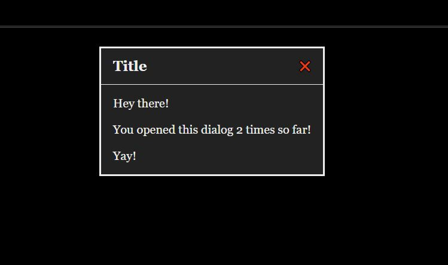

## Dialog

Harlowe doesn't have a user-accessible dialog system, so this script creates one and adds a macro for accessing it.



> **Get the Code**
>
> - [Minified](https://github.com/ChapelR/harlowe-macro-api/blob/master/examples/minified/dialog.min.js) 
> - [Pretty](https://github.com/ChapelR/harlowe-macro-api/blob/master/examples/dialog.js)
>
> **Required CSS**
>
> - [Minified](https://github.com/ChapelR/harlowe-macro-api/blob/master/examples/minified/dialog.min.css) 
> - [Pretty](https://github.com/ChapelR/harlowe-macro-api/blob/master/examples/dialog.css)

### Macro: `(dialog:)`

This macro opens the dialog box and adds the indicated title and classes, if any. The attached hook is then rendered into the box.

#### Syntax

```
(dialog: [title] [, classList])[ ... ]
```

#### Arguments

- `title` ( *`string`* ) ( optional ) The string to render into the title area of the dialog. If omitted, the title area will still be present, but be remain blank.
- `classList` ( *`string`* | *`string array`* ) ( optional ) You may pass a single string of space separated class names (e.g. `"my-class another-class a-third-class"`), an array of strings, or simply list several different strings as arguments to the macro to have them added to the `#dialog-frame` element of the dialog box (see below) for styling.

#### Returns

Nothing.

#### Examples

```
(set: $openedDialog to 0)\
(link-repeat: 'Open Dialog')[\
    (dialog: 'Title')[\
        (set: $openedDialog to it + 1) Hey there!
    
        You opened this dialog $openedDialog times so far!

        Yay!\
    ]\
]
```

### Styling Options

The generated HTML structure of the dialog element looks like this:

```html
<div id="dialog-overlay"> 
    <!-- the overlay blocks interaction with the page until the dialog is dismissed -->
	<div id="dialog-frame">
        <div id="dialog-header">
            <span id="dialog-title">[title]</span>
            <a id="dialog-close"></a>
        </div>
        <p>[hook content]</p>
    </div>
</div>
```

The `<tw-hook>` rendered into a dialog is given the class `in-dialog`.
