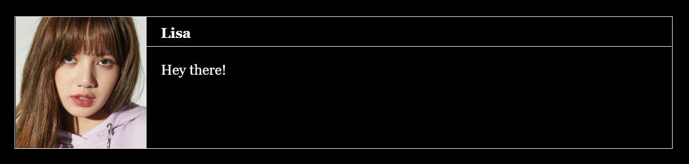

## Speech Box

A basic speech box macro. Ported over from [CMFSC2](http://macros.twinelab.net/). You can pre-define characters to associate with certain image sources, or supply both to the `(say:)` macro when you use it, or totally forgo images.



> **Get the Code**
>
> - [Minified](https://github.com/ChapelR/harlowe-macro-api/blob/master/examples/minified/speechbox.min.js) 
> - [Pretty](https://github.com/ChapelR/harlowe-macro-api/blob/master/examples/speechbox.js)
>
> **Required CSS**
>
> - [Minified](https://github.com/ChapelR/harlowe-macro-api/blob/master/examples/minified/speechbox.min.css) 
> - [Pretty](https://github.com/ChapelR/harlowe-macro-api/blob/master/examples/speechbox.css)

### Macro: `(say:)`

Creates a speech box with the indicated character name and image. Place the text the character should be saying in the attached hook.

#### Syntax

```
(say: name [, imgSrc])[ ... ]
```

#### Arguments

- `name` ( *`string`* ) The name of the character to be displayed in the name portion of the speech box. If there is a character definition set up via the `(character:)` macro, the image from that definition will be supplied.
- `imgSrc` ( *`string`* ) ( optional ) The image source URL, which, if provided, overrides the name definition one. If omitted and there is no definition, no image will be rendered.

#### Returns

Nothing.

#### Examples

```
(say: 'Lisa')[Hey there!]
(say: 'Bob', 'assets/bob.jpg')[I'm *sick* of being a **meme**!]
```

### Macro: `(character:)`

Associates a character name with an image source to be used in a `(say:)` macro speech box. Saves you from needing to type the image source repeatedly for commonly used or major characters.

!> The **best** place for a call to the `(character:)` macro is a [`startup`-tagged passage](https://twine2.neocities.org/#passagetag_startup).

#### Syntax

```
(character: name, imgSrc)
```

#### Arguments

- `name` ( *`string`* ) The name of the character to be associated with the image source.
- `imgSrc` ( *`string`* ) The image source URL to associate with the name.

#### Returns

Nothing.

#### Examples

```
(character: 'Lisa', 'assets/lisa.jpg')
```

### Styling Options

The generated HTML structure of the speech box element looks something like this:

```html
<div class="say">
    
    <p>[Name]</p>
    <p>[Content]</p>
</div>
```

The `.say` `<div>` is also given an attribute `data-character`,  that holds the character's name string, for per-character styling.

Selectors you may want to target:

- `.say`: the container and outer element.
- `.say img`: the portrait.
- `.say p:first-of-type`: the name text.
- `.say p:last-of-type`: the dialogue content text.